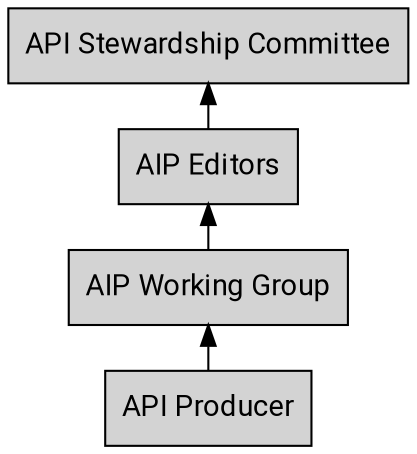

---
aip:
  id: 3
  state: approved
  created: 2020-03-06
  updated: 2020-07-24
  type: process
  scope: meta
js:
  - /assets/js/graphviz/viz.js
  - /assets/js/graphviz/lite.render.js
  - /assets/js/aip/aip-graphviz.js
permalink: /3
redirect_from:
  - /03
  - /003
  - /0003
---

# Stakeholders

As with any process there are many different stakeholders when it comes to
reviewing and working with AIPs. Below is a summary of the escalation path
starting with the API producer.

### API Stewardship Committee

The [API Stewardship Committee][aip-sc] is a group of API experts and
enthusiasts across multiple Salesforce Clouds. The Committee is part of the
larger [API LRP][aip-lrp].

The API Stewardship Committee meets regularly to review and approve AIPs
submitted by API Producers and AIP Editors.

### Editors

AIP editors make decisions about AIPs ensure that the process is collaborative across all contributing groups. We work largely on the basis of consensus, but a limited number of designated editors are responsible for approving each AIP.

To get in touch with the AIP editors, open a git issue or a pull request in the [AIP GitHub repository](https://git.soma.salesforce.com/API-Stewardship/sf.aip.dev).

The editors are also responsible for the administrative and editorial aspects
of shepherding AIPs and managing the AIP pipeline and workflow. They ensure AIPs are readable, approve
PRs to AIPs, assign proposal numbers, manage the agenda, set AIP states, and so
forth.

AIP editorship is by invitation of the current editors.

### AIP working group

The API Stewardship Committee will create working groups to investigate and
draft AIPs. Typically, members of the working group include multiple
engineering types (i.e. front end, back end, etc) that are interested in the
outcome of the AIP and from multiple clouds. An AIP editor is not required to
be a member of the working group but may be assigned as a partner.

An AIP working group can include members outside the API Stewardship Committee. If you are interested in participating in a working group to define the AIP,
comment in the issue. While interest in a working group is appreciated,
the API Stewardship Committee and the working group itself may limit group size to make it easier to come to a consensus. However, everybody is encouraged to participate in pull requests and
discussions on each issue.

<!-- prettier-ignore -->
[aip-sc]: https://confluence.internal.salesforce.com/display/APISTEWARD/API+Stewardship+Home

<!-- prettier-ignore -->
[aip-lrp]: https://docs.google.com/document/d/1EkCWLKPXi85H9-wJsS1Gqo3mcWR6BPFtHPYLCT9D39g/edit#heading=h.jv94keayzqia
[@cfineman]: https://git.soma.salesforce.com/cfineman
[@kelsey-lambert]: https://git.soma.salesforce.com/kelsey-lambert
[@rpolk]: https://git.soma.salesforce.com/rpolk
[@rspremulli]: https://git.soma.salesforce.com/rspremulli
[@rhamilton]: https://git.soma.salesforce.com/rhamilton
