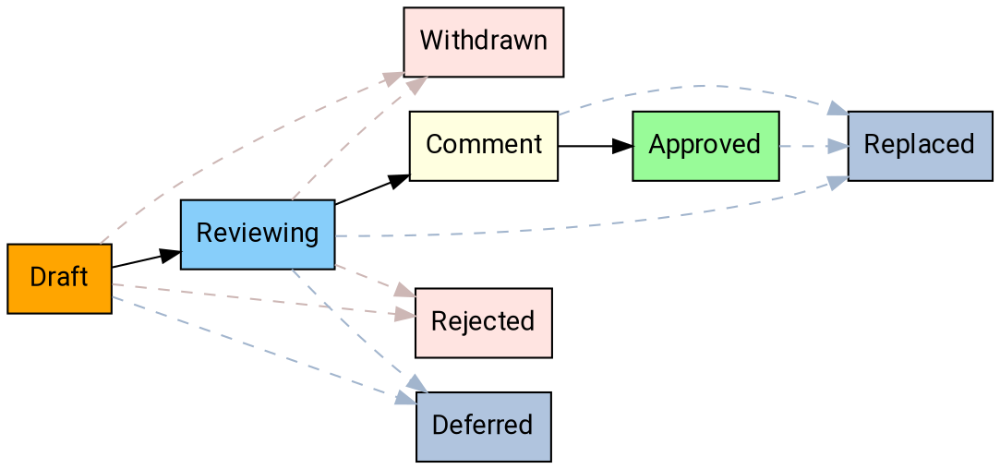

---
aip:
  id: 5
  state: approved
  created: 2020-03-06
  updated: 2020-07-24
  type: process
  scope: meta
js:
  - /assets/js/graphviz/viz.js
  - /assets/js/graphviz/lite.render.js
  - /assets/js/aip/aip-graphviz.js
permalink: /5
redirect_from:
  - /05
  - /005
  - /0005
---

# Workflow

This workflow describes the process for proposing an AIP and moving
an AIP from proposal to implementation to final acceptance. These states are
defined in [AIP 4][0004].

## Overview

## Proposing an AIP

To propose an AIP, first [open an issue][issues] to circulate the
fundamental idea for initial feedback. You should be able to
describe the idea in a couple of paragraphs. You are encouraged to promote the
proposal and discussion within the issue comments among other engineers and
members of the AIP Stewardship Committee.

When ready to consider the AIP, the API Stewardship Committee assigns the
proposal an AIP and forms a working group. As the original proposer, you may be
invited to join the working group. If so, a member of the API Stewardship
Committee will reach out to you.

The working group creates a PR containing a AIP in **draft** status to be
reviewed by the API Stewardship Committee and the appropriate stakeholders.

If the AIP is rejected outright or abandoned by the working group, the AIP is not merged and the AIP number may be assigned to a different AIP.

## Reviewing an AIP

Once the PR is merged, the AIP Stewardship Committee reviews the AIP and
ensures it is reviewed by the appropriate stakeholders. The assigned working
group is responsible for bringing the AIP to the API Stewardship Committee
meetings. The original proposer **should** use the GitHub issue used to generate the proposal to continue to champion the AIP to the API Stewardship Committee.

The AIP working group may modify the AIP over the course of discussion by
submitting follow-up commits to the PR.

## Accepting an AIP

The API Stewardship Committee works together to ensure that qualified
proposals do not linger in review.

To gain final approval, an AIP **must** be approved by at least one architect
on the API Stewardship Committee and an AIP editor, neither of which can be a member of the AIP working group that drafted the AIP.

Once the AIP is approved, the editors update the state of the AIP to
**comment** and submit the PR.

During the 60 day commenting period, the AIP is eligible to be updated based on feedback from public comments. If public comments warrant updates, the AIP will be returned back to the review status.

If no changes are made for 60 days upon entering the **comment** status, the AIP will be moved to **approved**.

## Withdrawing or rejecting an AIP

The AIP working group or API Stewardship Committee may decide after further
consideration that an AIP should not advance. If so, the AIP may be withdrawn by
updating the PR, adding a notice of withdrawal to the PR that explains the
rationale. Additionally, the working group may be unable to get consensus among
the group and the API Stewardship Committee may elect to reject the AIP. In
this situation, the AIP editors will add a notice of rejection to the PR that
explains the rationale. In both cases, the AIP editors update the
state accordingly and submit the PR.

## Replacing an AIP

In rare cases, it may be necessary to replace an AIP with another one. This is
not general practice; minor edits to approved AIPs are the preferred way to update guidance. However, if new guidance fundamentally alters
the old guidance in some way, then the AIP editors should create a new AIP that replaces the old one. The old one then enters the **replaced** state, and
links to the new, current AIP.

[0004]: ./0004.md
[issues]: {{ site.github.repository_url }}/issues
