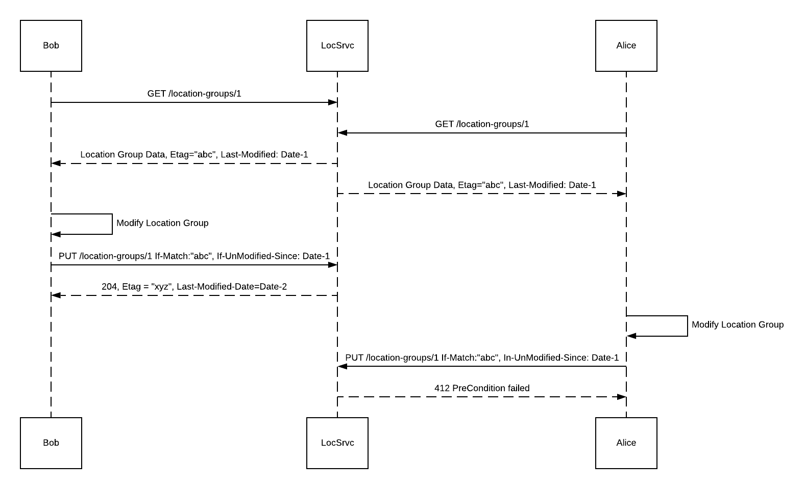

---
aip:
  id: 134
  state: reviewing
  created: 2020-01-15
  updated: 2020-07-24
  scope: method
js:
  - /assets/js/graphviz/viz.js
  - /assets/js/graphviz/lite.render.js
  - /assets/js/aip/aip-graphviz.js
permalink: /134
---

# Standard methods: Update

After a resource has been added to the system, the resource can change or be updated. Updates can happen as part of a resource life cycle, such as when the status of a resource changes from `In Progress` to `Completed`. Alternatively, a resource can be updated when new information about that resource becomes available, or to enable a client to correct faulty information.

## Guidance

APIs **should** provide at least one update method for resources unless there is a reason users don't need to do this. Update methods allow you to make changes to a resource.

Update methods **must** be performed against a URL ending in a resource ID (for example, `/publishers/{publisherId}`). Standard update methods **must not** directly update more than one resource at a time. Standards for batch updates will be defined in a future AIP.

There are two HTTP methods for updating: `PUT` and `PATCH`.

### Request message

When only selected properties of a resource need to be updated the `PATCH` method **should** be used.

The payload of a `PATCH` request describes the changes that must be performed against the resource. The standard `PATCH` method **must** be implemented in accordance with [RFC 5789][]. Additionally, `PATCH` methods **must** be implemented according to JSON merge patching as outlined in [RFC 7396][].

JSON merge patching requires that the payload of the `PATCH` method contains the fields of the resource to be updated and the values they should be updated to as follows:

```
PATCH /publishers/{publisherId}

{
  "telephone": "5554441234"
}
```

If performing a `PATCH` against a resource does not result in additional information to be returned to the client, the server **should** respond with a `204`. However if a payload is returned as the result of a `PATCH`, the server **must** return a `200`.

### Create or update

If the API accepts client-generated resource IDs, the server **may** allow updates via the `PUT` method. Use the `PUT` method to create or replace the state of the target resource with the state provided in the method payload. The `PUT` method is best used for scenarios when you are unsure of whether the resource already exists in the system or not.

The standard `PUT` method **must** be implemented in accordance with [RFC 7231-4.3.4][].

The payload of a `PUT` request against a resource **should** be the same shape as the payload of a `GET` request against that same resource when possible.

```
PUT /books/123

{
  "id": "123",
  "title": "Seven Habits of Highly Effective People",
  "author": "Stephen Covey"
}
```

Note that the `id` in the query path is also a property in the payload. While this may seem redundant, this is required to follow proper REST conventions around both resource addressing and `PUT` method standards. If the ID in the path and the resource do not match, the server **must** return a `400` error.

Because `PUT` is usually used when the client knows all information about the resource being updated, responses to `PUT` methods **should** return a `204` if the resource already existed and the `PUT` operation changed that state of the resource. If additional information must be provided to the client concerning the state of the `PUT` resource, the operation **may** return a response body. If a response body is returned, the status code of the response **must** be `200`.

If the resource already existed and the `PUT` request did not change the state of the existing resource, the status code of the response **must** be `409`. This provides greater visibility to the client concerning the state of the resource before and after the method was performed, and should be treated as an optional error to handle.

If the resource included in the `PUT` payload did not already exist, the response should return `201`. For more information on using `PUT` as a method for creation, see [AIP 133][create].

### Side effects

Side effects are allowed as a result of an update method. However, the `PUT` method is considered idempotent. So any side effect that is triggered by a `PUT` method **must** be idempotent.

The `PATCH` method is not considered idempotent. So any side effect trigged by a `PATCH` method **may not** be idempotent.

### Etags

It is possible for multiple clients to be updating a resource at the same time. If two users are updating the same record at the same time, one user's record could override the changes of the other user, leading to non-deterministic behavior.

To avoid this, API designers **should** make use of optimistic concurrency control utilizing the `If-Match` and `If-Unmodified-Since` headers. In the event of concurrency, one client will receive a failure with a status code of `412` indicating a Pre-Condition failed.

Consider an example where Bob and Alice are both using Business Manager UI to modify the same `locationGroups` resource, i.e. `location-group-1`. When they request the group, the both receive the etag `abc`, which was last modified on a specific date. Bob is able to make and submit his changes to `location-group-1` first, so his request goes through and the etag in the `If-Match` header and the date in `If-Unmodified-Since` header match up. When Alice makes her changes and submits, the request will fail as the etag and modified date no longer match. She would receive a `412` (Pre-Condition Failed) response.



## Commutative updates

While optimistic locking may work for a resource that might only have a few clients attempting to update it concurrently, it will not scale well for resources that my be updated by thousands, or millions of concurrent clients.

Consider a public resource that may be affected by thousands of concurrent users, like a counter or a poll. If one thousand users request the state of the counter at the same time, only one of them will be able to update that state. After updating that state, the other 999 users would then need to request the updated state before they would be allowed to make an update, upon which only one of those clients would be able to update, and the remaining 998 clients would need to update again. This would continue until all one thousand clients were able to make an update. And this does not even take into account that each of those clients may have additional updates to make to that resource.

The problem with this scenario is that `PUT` and `PATCH` are not commutative operations, and are therefore not safe to be performed against a resource without concurrency locking. Thus, these update methods **should not** be used for resources that require frequent (as in sub second) updates across many (as in hundreds or more) clients.

Therefore, when possible, commutative operations **should** be preferred over concurrency management.

As a simple example, consider the following counter object:

```
{
  "id": 123
  "quantity": 10000
}
```

In order to allow commutative updates on the `quantity` property of this resource, this property would need to be broken out into a sub-resource:

```
/counters/123/quantity/
```

Now quantity becomes a resource collection against which `quantity` resources may be added or removed concurrently without fear of overriding, as adding and subtracting are commutative operations.

```
POST /counters/123/quantity
# empty body implies adding a single resource

{
  "count": 3
}

DELETE /counters/123/quantity
# empty body implies removing a single resource
{
  "count": 2
}
```

**Note:** A good indicator that commutative operations can be used is when the property can be named using a plural noun. This aligns with the requirement in [AIP 122][AIP-122] that collection identifiers **must** be plural. The usage of `quantity` here refers to the uncountable noun "quantity", for which the singular and plural forms are the same, and therefore satisfies the requirements for resource names to be plural.

[RFC 7231-4.3.4]: https://tools.ietf.org/html/rfc7231#section-4.3.4
[RFC 5789]: https://tools.ietf.org/html/rfc5789
[RFC 7396]: https://tools.ietf.org/html/rfc7396
[Updating composition resources]: #updating-composition-resources
[create]: ./0133.md
[delete]: /0135.md
[AIP-122]: ./0122.md
