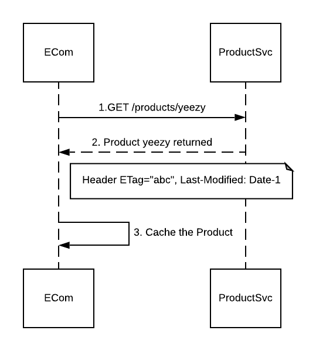
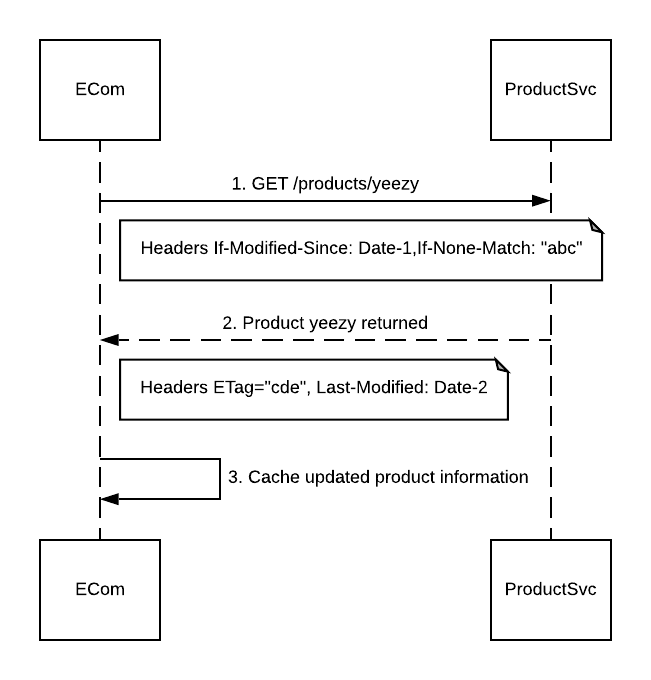

---
aip:
  id: 154
  state: approved
  created: 2020-01-15
  updated: 2020-07-24
  scope: resource
js:
  - /assets/js/graphviz/viz.js
  - /assets/js/graphviz/lite.render.js
  - /assets/js/aip/aip-graphviz.js
permalink: /154
---

# Resource freshness validation

APIs often need to validate that a client and server agree on the current state of a resource before taking some kind of action on that resource. For example, two processes updating the same resource in parallel could create a race condition, where the latter process "stomps over" the effort of the former one.

Etags provide a way to deal with this, by allowing the server to send a checksum based on the current content of a resource; when the client sends that checksum back, the server can ensure that the checksums match before acting on the request.

Additionally, this also allows the client to confirm with the server that it has the latest state of a resource before making any decisions that might be dependent on that resource state.

# Guidance

Consider the following example where the Ecom service is communicating with the ProductSvc concerning the state of the `yeezy` product:



ECom could subsequently cache the **yeezy** product returned by the Product Service.  During the cache validation period, ECom does not need to request the product data from the origin server. However, once the cache has timed out a request is issued by the Client with the following headers:

```
GET /products/yeezy
If-Modified-Since: Date-1
If-None-Match: "abc"
```

If the resource for the product is unchanged on the service, the service responds back with a **304** status code (Not Modified)  and no content in the body. If the resource has changed, the origin server responds back with a **200** (OK) and new Last-Modified  Date and new ETag along with the updated Product information.


